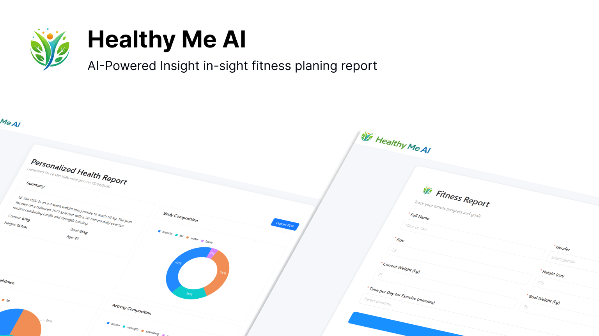

# Healthy Me AI

Healthy Me AI is a take-home assignment project that generates a personalized fitness report from user inputs using Google Gemini, then lets users review report history and export reports to PDF.

## Preview




## Quick Start

### Requirements

- Node.js 20+
- A Gemini API key in `.env` as `VITE_GEMINI_API_KEY`

### Run locally

```bash
pnpm install
cp .env.example .env
# set VITE_GEMINI_API_KEY in .env
pnpm dev
```

Open the app at the URL shown in terminal.

## Quick Check (2-3 minutes)

1. Fill out the fitness form and click **Generate AI Report**.
2. Confirm the report renders (summary, charts, nutrition/activity/body sections).
3. Open history and verify the new report appears.
4. Export the report to PDF and confirm file download.

## Core Files

- [`app/features/home/index.tsx`](./app/features/home/index.tsx): main page flow (form submission, Gemini call, report state/history).
- [`app/lib/gemini.ts`](./app/lib/gemini.ts): prompt generation and Gemini request wrapper.
- [`app/features/home/components/report-card/hooks/use-report-pdf-export.ts`](./app/features/home/components/report-card/hooks/use-report-pdf-export.ts): report capture and paginated PDF export.

## Scripts

| Command          | Description                                    |
| ---------------- | ---------------------------------------------- |
| `pnpm dev`       | Start development server                       |
| `pnpm build`     | Create production build                        |
| `pnpm start`     | Serve production bundle                        |
| `pnpm typecheck` | Generate route types and run TypeScript checks |

## Notes

- This repository calls Gemini directly from the client for demo/interview purposes only.
- Do not use client-side API key exposure for production systems.

## License

Licensed under the MIT License. See [`LICENSE`](./LICENSE).
